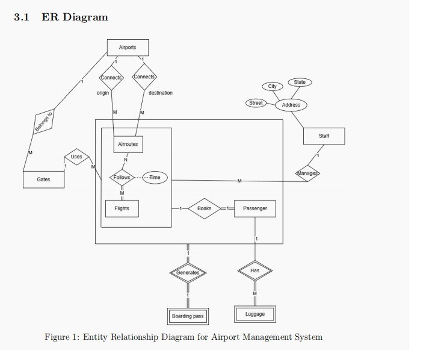

# ✈️ Airport Management System

A database-driven system for managing core airport operations — passenger handling, flight scheduling, gate allocation, boarding-pass generation, luggage tracking, and staff access control — built on **PostgreSQL** with a thin **Node.js** front end.

> A DBMS course project focused on relational design, server-side business logic in PL/pgSQL, and database-level role security.


---

## Overview

The system models a working airport back office. Passengers are registered and booked onto scheduled flights; a boarding pass is generated automatically on confirmation with seat, gate, and boarding time; luggage is checked in and cleared by security; and staff operate the system through four database roles with strictly scoped permissions. Data integrity is enforced at the database layer through constraints and triggers rather than trusting the application.

## Key Features

- **11-table normalized schema (3NF)** covering passengers, staff, airports, routes, gates, flights, schedules, bookings, boarding passes, luggage, and staff assignments.
- **32 PL/pgSQL functions and procedures** implementing every operational workflow (registration, booking, gate assignment, luggage clearance, flight scheduling, and more).
- **14 triggers** enforcing business rules — capacity limits, double-booking prevention, gate-conflict detection, luggage weight limits, and automatic boarding-pass generation.
- **Database-level Role-Based Access Control** across four roles (`admin`, `checkin_staff`, `security_staff`, `ground_staff`) — no user touches tables directly.
- **7 role-scoped views** that pre-join complex multi-table relationships for each role.
- **Deliberate index strategy** using B-Tree, Hash, and GIN indexes matched to query type.
- **Audit trail** logging every flight-status change to a dedicated log table.

---

## Tech Stack

| Layer | Technology |
|-------|-----------|
| Database | PostgreSQL |
| Server-side logic | PL/pgSQL (functions, procedures, triggers) |
| Access control | Native PostgreSQL roles |
| Front end | Node.js + Express, static HTML |
| Tooling | pgAdmin |

---

## Database Design

### Entity–Relationship Diagram




The schema uses **nested aggregation**: the `Follows` relationship between `Airroutes` and `Flights` is aggregated into a scheduled-flight unit, which is then aggregated again with `Passenger` (via `Books`) to model that a boarding pass is only produced when a specific passenger books a specific flight on a specific route.

### Core Entities

| Table | Purpose |
|-------|---------|
| `Passenger` | Personal and travel details |
| `Staff` | Login, role, and address; drives database role provisioning |
| `Airport` / `Airroutes` | Airports and origin→destination routes with distance |
| `Gates` | Gate inventory with availability status |
| `Flights` / `Scheduled_Flight` | Aircraft and dated schedule with gate assignment |
| `Bookings` / `Boarding_Pass` | Reservations and auto-generated passes |
| `Luggage` | Bag records with weight and security clearance |
| `Staff_Manages` | Which staff member manages which scheduled flight |

---

## Standout Engineering

### Database-level RBAC with automated role lifecycle
Access control lives in the database, not the app. Three triggers on the `Staff` table (`auto_create_staff_role`, `auto_update_staff_role`, `auto_drop_staff_role`) automatically **create, re-grant, and drop native PostgreSQL login roles** — and even terminate active sessions — whenever a staff record changes. This removes manual DBA role management entirely.

### Index strategy matched to access pattern
Rather than indexing everything, index types are chosen by query shape:
- **B-Tree** for range and composite lookups (dates, route+flight pairs)
- **Hash** for exact-equality status filters (booking / luggage / gate status)
- **GIN + `pg_trgm`** for `ILIKE` fuzzy search on names

### Consistency enforced by triggers
Business rules that a naive app would leave to chance are enforced at insert/update time: overbooking, double bookings, overlapping gate assignments, luggage over 30 kg, and bookings on cancelled or departed flights are all rejected by the database itself.

---

## Repository Structure

```
airport-management-system/
├── database/
│   ├── 01_schema.sql          # CREATE TABLE + constraints
│   ├── 02_functions.sql       # PL/pgSQL functions & procedures
│   ├── 03_triggers.sql        # Trigger functions + triggers
│   ├── 04_roles_grants.sql    # Roles, privilege grants
│   ├── 05_views.sql           # The 7 views
│   ├── 06_indexes.sql         # B-Tree / Hash / GIN indexes
│   └── 07_seed.sql            # Sample data
├── public/
│   └── index.html
├── docs/
│   ├── er-diagram.png
│   └── final_report.pdf
├── server.js
├── package.json
├── .gitignore
└── README.md
```

---

## Getting Started

### Prerequisites
- PostgreSQL 14+
- Node.js 18+
- The `pg_trgm` extension (bundled with PostgreSQL; enabled by the index script)

### 1. Create the database
```bash
createdb airport_management
```

### 2. Load the schema and logic (in order)
```bash
psql -d airport_management -f database/01_schema.sql
psql -d airport_management -f database/02_functions.sql
psql -d airport_management -f database/03_triggers.sql
psql -d airport_management -f database/04_roles_grants.sql
psql -d airport_management -f database/05_views.sql
psql -d airport_management -f database/06_indexes.sql
psql -d airport_management -f database/07_seed.sql
```

### 3. Configure and run the server
```bash
cp .env.example .env      # set DB connection values
npm install
node server.js
```

Then open `http://localhost:3000`.

---

## Example Workflow — Passenger Check-In

```sql
-- 1. Find the passenger (GIN trigram search)
SELECT * FROM SearchPassenger('Priya');

-- 2. Pull their bookings (B-Tree index on Passenger_ID)
SELECT * FROM GetBookingsByPassenger(2);

-- 3. Full booking details in one query (pre-joined view)
SELECT * FROM BookingDetailsView WHERE Passenger_ID = 2;
```

The report walks through five such role-based workflows end to end, each combining functions, views, roles, and indexes.

---

## Design Notes & Trade-offs

Running `CREATE ROLE` / `DROP ROLE` from inside triggers is elegant for this scope, but in a production system role provisioning would typically move to the application or a dedicated service layer — triggers with DDL side effects are harder to reason about, need elevated privileges, and complicate replication. It's included here as a deliberate exploration of what the database *can* enforce on its own.

Sample data is intentionally small for demonstration. On these row counts PostgreSQL's planner may still choose sequential scans; the index design is built to pay off as the tables grow.

---

## Report

The full design report (ER diagram, complete DDL, privilege matrix, and query walkthroughs) is in [`docs/final_report.pdf`](docs/final_report.pdf).

## Team

- B. Gopi Chand
- K. Vishnu Vardhan
- N. Saketh
- V. Sai Yasaswi

*DBMS course project.*